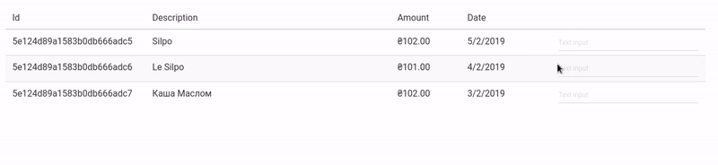

# Updated at January 2021

This project is archieved and would not be continued. I've implemented native iOS app and necessity of having web based UI is gone.

# spendshelf-ui

Spendshelf started as a desire to keep money spending in the personal or/and family budget under control.

All incoming transactions are being sent to categories - and each category has a monthly budget (spent money limit). At the end of the budget period (usually at the end of the months or near to salary date) - you either close to monthly budget per each category (which is good) - or not (which is bad). 

## Current status

Project is being actively developed by @suddengunter and @markelrep. At the moment only monobank webhooks are supported as incoming source, and web UI only has one page - we keep it simple and add only things we need.

## Contributors guide

All contributions are welcomed through pull requests

## Backend

see backend at https://github.com/lungria/spendshelf-backend/
